# Developer Guide

---

## Table of Contents

---

[1. Introduction](#1-introduction)  
[2. Setup Guide](#2-setup-guide)  
&nbsp;&nbsp;[2.1 Prerequisites](#21-prerequisites)  
[3. Design](#3-design)  
&nbsp;&nbsp;[3.1 Architecture](#31-architecture)  
&nbsp;&nbsp;[3.2 Parser Class](#32-parser-class)  
&nbsp;&nbsp;[3.3 UI Class](#33-ui-class)  
&nbsp;&nbsp;[3.4 Command Class](#34-command-class)  
&nbsp;&nbsp;[3.5 Validator Classes](#35-validator-classes)  
&nbsp;&nbsp;[3.6 Expense and Income Class](#36-expense-and-income-class)  
[4. Implementation](#4-implementation)  
&nbsp;&nbsp;[4.1 Expense Features](#41-expense-features)  
&nbsp;&nbsp;&nbsp;[4.1.5 Display Monthly Expenses](#415-display-monthly-expenses)  
&nbsp;&nbsp;&nbsp;[4.1.6 Display Expenses for Month with Categories](#416-display-expenses-for-month-with-categories)  
&nbsp;&nbsp;[4.2 Income Features](#42-income-features)  
&nbsp;&nbsp;[4.3 Budget Features](#43-budget-features)  
&nbsp;&nbsp;[4.4 Savings Features](#44-savings-features)  
&nbsp;&nbsp;[4.5 Miscellaneous Features](#45-miscellaneous-features)  

## Acknowledgements

---

{list here sources of all reused/adapted ideas, code, documentation, and third-party libraries -- include links to the original source as well}

## 1. Introduction

---

BudgetBuddy is a CLI-based expense, income and budget tracking application. BudgetBuddy is designed to help users manage and monitor their daily and monthly expenses. The system tracks various categories of expenses and allows users to receive insights on their budget and spending patterns.

## 2. Setup Guide

---

This section describes how to setup the coding environment, along with the tools needed to work on BudgetBuddy

### 2.1 Prerequisites
1. JDK 17
2. Any working IDE that supports Java (Intellij IDEA preferred)

## 3. Design

---

### 3.1 Architecture
The following diagram shows the rough overview of BudgetBuddy

`BudgetBuddy` is the main class of application which the user can interact with directly.  The input from the user is 
processed by the main class and passed to the `Parser`. `Parser` will check for any valid keywords in the input using 
the `isCommand` method of all the `Command` object. Once the keywords are present, it will pass the input to a 
`Validator` object which validates the command on its formatting and details. Depending on the result of the `Validator`
, the command will be executed in `BudgetBuddy`. The `Validator` and `Object` genre classes utilizes methods and classes
present in the transaction folder.

### 3.2 Parser Class
The `Parser` class is to mainly determine whether the user input is valid, and proceed to process the command after.
It uses Boolean Methods to determine the presence of keywords, and then creates a Validator class to process the command
should the keywords be present.

The following are some examples:

| Boolean Methods                          | Check if input starts with | Feature Requires | Creates                                            |
|------------------------------------------|----------------------------|------------------|----------------------------------------------------|
| `ListMonthlyExpensesCommand.isCommand()` | list monthly expenses      | input            | ListMonthlyExpensesValidator.processCommand(input) |
| `AddExpenseCommand.isCommand()`          | add expense                | input            | AddExpenseValidator.processCommand(input)          | 

The Parser class is also used to parse lines from the `Storage` .txt file and loads it into the main application upon
restart. This will be covered more under the storage class.

### 3.3 UI Class

The UI Class is to print out elements of the app in the CLI. It contains many methods used to print general, often-used
messages such as displayWelcomeMessage() and displayExitMessage().

### 3.4 Command Class

The `Command` class is a parent class which is responsible for checking for input keywords. It has multiple subclasses,
which corresponds to a specific function of the application. Each of its subclass checks for specific keywords in the
user input. If the input is valid as checked by the `isCommand()` method, it will call its corresponding validator.

### 3.5 Validator Classes

The Validator classes are a group of classes which is responsible for further checks on input, such as whether it has
the right formatting and contains all necessary details. It will return different subclasses of the command object
depending on whether the input is valid or not. Once the object is instantiated and returned, the `main` class will call
`execute` to execute the feature.

The following sequence diagram shows the process of what happens when a user input is passed through the application,
until it gets executed.

**Note**: 
1. Validator class is not a parent class, but we have grouped it under validators to prevent cluttering of 
the diagrams. 
2. Validator also returns different type of Command Classes depending on the validity of input, which has been omitted
for the same reason as above.

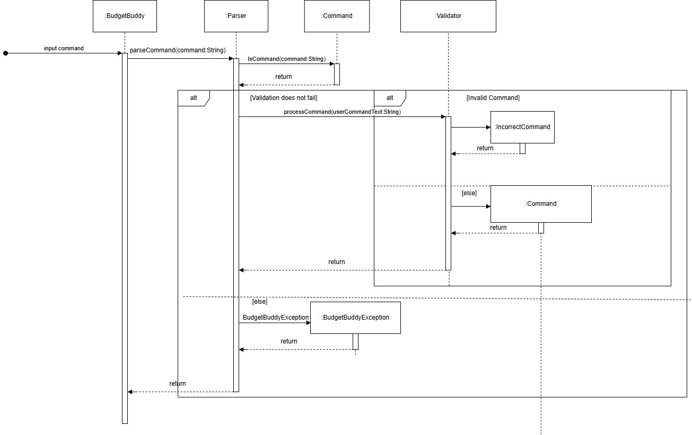

### 3.6 Expense and Income Class
The `Expense` and `Income` class inherits from the Transaction class.

`Expense` class stores one expense record given by the user.

`Income` class stores one income record given by the user.

The methods for `Expense` and `Income` are not shown.

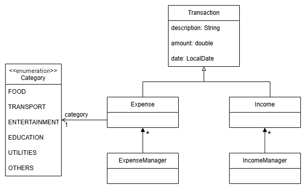

## 4. Implementation

---
### 4.1 Expense Features

---
#### 4.1.2 Search Expense Feature
The Search Expense Feature enables users to search for specific expenses based on a description provided by the
user. This feature is managed by the `SearchExpensesCommand` class, initialized by the `Parser` class, with the help
of a helper class `SearchExpenseValidator` to validate and extract the user description.
The `SearchExpensesCommand` object is then created with the keyword as an attribute. The class attributes and their
relevance is as follows:

|Variable Name| Variable Type | Relevance |
|-------------|---------------|-----------|
|keyword| String | Description to find in expenses|

The BudgetBuddy class then calls the `execute()` method of the `SearchExpenseCommand` object which uses the
`searchExpenses()` method in the `ExpenseManager` class, displaying the result to the user using the `Ui` class
`displayToUser()` method.

Below is a sequence diagram representing the execution of the Search Expense interaction:

Process Overview:
1. The user issues a command to search for a specific expense i.e. `search expense Japan`. BudgetBuddy parses this
   input with the help of the `Parser` class.
2. The `Parser` calls the `isCommand()` method of the `SearchExpenseCommand` class, to check if the user input
   starts with "search expense".
3. If the user input starts with "search expense", the `Parser` then calls the `processCommand()` method of
   a helper class, `SearchExpenseValidator` to extract the description to be filtered on.
4. The `processCommand()` method above returns a new `SearchExpenseCommand` object initialized with the description
   extracted as the `keyword` attribute.
5. BudgetBuddy then calls the `execute()` method of the `SearchExpenseCommand` object.
6. If the keyword attribute is an empty string, the `SearchExpenseCommand` object calls the `searchEmptyMessage()`
   method of the `Ui` class, displaying an error message to the user that no descriptor was provided.
7. Else, the `SearchExpenseCommand` object calls the `searchExpenses()` method of the `ExpenseManager` class,
   filtering the `expenses` ArrayList and returning a String containing all expenses with the given descriptor
   in the description of the expenses. The `SearchExpenseCommand` object then calls the `displayToUser()` method in `Ui`,
   displaying this String to the user.

#### 4.1.4 Breakdown Expense Feature
The Breakdown Expense Feature allows users to gain greater insights into their expense history. The feature
makes use of the user's expense history, breaking down their total expense into the different categories, displaying
this result to the user. This allows the user to know where they are spending their money. This feature differs from
the List Expense Feature in that this feature gives a quick overview of a user's expenditure, in terms of categories.

This feature is managed by the `BreakdownExpensesCommand` class, initialized by the `Parser` class upon user input. The
`BudgetBuddy` class then calls the `execute()` method of the `BreakdownExpensesCommand` object, which uses the
`breakdownExpensesByCategory()` method in the `ExpenseManager` class to execute the functionality, displaying
the result via the `displayToUser()` method in the `Ui` class.

Below is the sequence diagram for the execution of the Breakdown Expense Feature interaction:
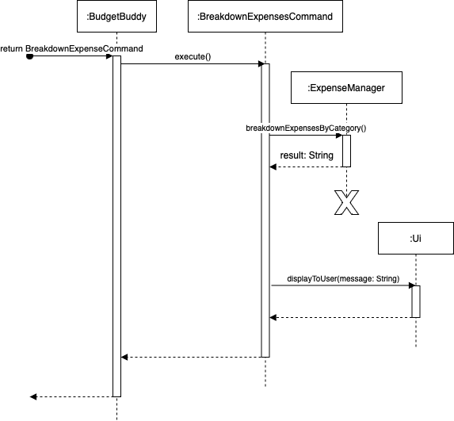

#### 4.1.5 Display Monthly Expenses
The Display Monthly Expenses feature displays an XY-Chart which helps shows user's monthly expenses across the specified
year. This functionality is controlled by the `DisplayTotalExpensesCommand` class which uses
`DisplayTotalExpensesValidator` class to validate the command string and year, and performs the deduction if valid.
Below shows the relevance of the attribute:

| Class Attribute | Variable Type | Relevance                                        |
|-----------------|---------------|--------------------------------------------------|
| year            | int           | The specified year of the chart to be displayed  |

The `BudgetBuddy` class then calls `execute()` method of `DisplayTotalExpensesCommand` object which uses the
`displayExpensesOverMonthGraph(int year)` method in `ExpenseManager` class to display the chart.

The following methods in `ExpenseOverMonthGraph` class is called by `displayExpensesOverMonth(int year)` method to
display the chart from XChart.

| Method                                                             | Return Type              | Relevance                                                                                                         |
|--------------------------------------------------------------------|--------------------------|-------------------------------------------------------------------------------------------------------------------| 
| `monthMapBuilder(ArrayList<Expense> expense)`                      | `Map<YearMonth, Double>` | Builds a Hashmap of with each key being months and each value being the total expenses of the corresponding month |
| `chartPrinter(Map<YearMonth, Double> monthlyExpenseMap, int year)` | `void`                   | Prints the XY-Chart of the specified year                                                                         |

Finally, the XChart library will be called to build the chart and display it with SwingWrapper.

The following UML Sequence diagram shows how Parser works to obtain all relevant inputs for this feature.
We assume that the command for this feature has already been created and returned to `BudgetBuddy`.
The starting arrow indicates return of the command based on the sequence diagram at [3.5 Validator Classes](#35-validator-classes)

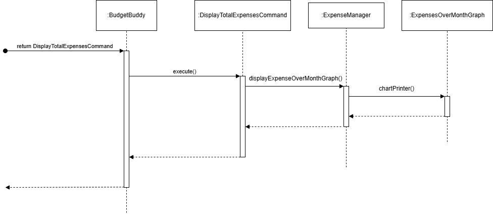

#### 4.1.6 Display Expenses for Month with Categories
The Display Expenses for Month with Categories displays a pie chart which helps shows user's expenses weightage for each
category for the specified month. This functionality is controlled by
`DisplayExpensesForMonthWithCategoriesGraphCommand` class which uses the
`DisplayExpensesForMonthWithCategoriesGraphValidator` class to validate the command string and date in YearMonth format,
and performs the deduction if valid. Below shows the relevance of the attribute.

| Class Attribute | Variable Type | Relevance                                                 |
|-----------------|---------------|-----------------------------------------------------------|
| yearMonth       | YearMonth     | The specified year and month of the chart to be displayed |

The `BudgetBuddy` class then calls `execute()` method of `DisplayExpensesForMonthWithCategoriesGraphCommand` object
which uses the `displayExpensesForMonthWithCategoriesGraph(YearMonth yearMonth)` method in `ExpenseManager` class to
display the chart.

The following methods in `ExpensesCategoryPieChart` class is called by
`displayExpensesForMonthWithCategoriesGraph(YearMonth yearMonth)` method to display the chart from XChart.

| Method                                                                                                | Return Type             | Relevance                                                                                  |
|-------------------------------------------------------------------------------------------------------|-------------------------|--------------------------------------------------------------------------------------------|
| `expensesByCategoryMapBuilder(YearMonth yearMonth)`                                                   | `Map<Category, Double>` | Builds a Hashmap with key being category and value is the total expenses for each category |
| `getTotalExpensesForMonthWithCategories(YearMonth yearMonth, Category category)`                      | `double`                | Helps to calculate the total expenses for the specified month given a category             |
| `displayExpenseByCategoryPieChart(YearMonth yearMonth, Map<Category, Double> expensesByCategoryMap)`  | `void`                  | Prints the Pie Chart of the specified month and year                                       |

Finally, the XChart library will be called to build the chart and display it with SwingWrapper.

The following UML Sequence diagram shows how Parser works to obtain all relevant inputs for this feature.
We assume that the command for this feature has already been created and returned to `BudgetBuddy`.
The starting arrow indicates return of the command based on the sequence diagram at [3.5 Validator Classes](#35-validator-classes)

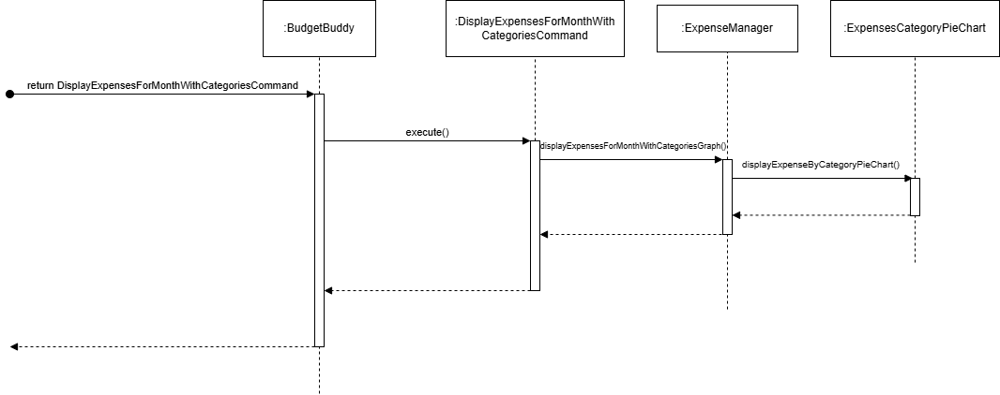

### 4.2 Income Features

---

### 4.3 Budget Features

---

### 4.4 Savings Features

---
#### 4.4.1 Display Savings Feature
The Display Savings Feature enables users to check how much they have saved, through their inputs into the application.
We assume that the user has accurately reflected all expenses and incomes, and we calculate their savings by
taking Savings = Total Income - Total Expense. The user has the option to either
display their total savings, or their savings per month since using the app. This feature is managed by the
`DisplaySavingsCommand` class, initialized by the `Parser` class using the `DisplaySavingsValidator` class to display
the correct savings, according to the user input.
The `DisplaySavingsCommand` object is then created with a boolean as an attribute. The class attributes and their
relevance is as follows:

|Variable Name| Variable Type | Relevance                                                                   | 
|-------------|---------------|-----------------------------------------------------------------------------|
|byMonth| boolean | Indicates whether the user wants to display by month or just total savings. |

The BudgetBuddy class then calls the `execute()` method of the `DisplaySavingsCommand` object which uses the
`displaySavings()` or `displaySavingsByMonth()` method in the `SavingsManager` class, displaying the result to the
user using the `Ui` class `displayToUser()` method.

Below is a sequence diagram representing the execution of the Display Expense interaction:

Process Overview:
1. The user issues a command to display savings i.e. `display savings m/`. BudgetBuddy parses this input with the help
   of the `Parser` class.
2. The `Parser` class calls the `isCommand()` method of the `DisplaySavingsCommand` class, to check if the user input
   starts with "display savings".
3. If the user input starts with "display savings", the `Parser` then calls the `processCommand()` method of
   `DisplaySavingsValidator` to determine if the user wants a monthly breakdown of savings or simply their total savings.
4. The `processCommand()` method above returns a new `DisplaySavingsCommand` object initialized with a `byMonth`
   attribute, set to true if the user wants a monthly breakdown of savings. Otherwise if the user just wants their total
   savings, this attribute will be set to false.
5. BudgetBuddy then calls the execute() method of the `DisplaySavingsCommand` object.
6. Depending on the `byMonth` attribute, either `displayTotalSavingsByMonth()` or `displayTotalSavings()` will be
   executed from the `SavingsManager` class.
7. The respective methods then save the results in a String, and returns this String to the `DisplaySavingsCommand`,
   which then calls the `displayToUser()` method in `Ui`, displaying this String to the user.

The class diagram below indicates the structure of the DisplaySavings Feature, involving `SavingsManager`, `Saving`,
`IncomeManager` and `ExpenseManager`.

### 4.5 Miscellaneous Features

---
#### 4.5.1 Display Help Feature
The Display Help Feature serves as a guide for new users, displaying a list of features and an example command
for each feature. The feature is managed by the `HelpComand` class, initialized by the `Parser` class upon user input.
The `BudgetBuddy` class then calls the `execute()` method of the `HelpCommand` object, which uses the
`displayHelpMessage()` method of the `Ui` class.

Below is the sequence diagram for the execution of the Display Help Feature:

#### 4.1.1 Add Expense Feature
The Add Expense feature enables users to add budgets for different categories. This functionality is controlled by the
AddExpenseCommand class, which is produced by the Parser class based on user input. The AddExpenseCommand class uses an
AddExpenseValidator class to validate the provided description, amount, category, and date, and then create and add the
given information to `AddExpenseCommand` if valid. Below is the relevance of these attributes:

| Class Attribute | Variable Type | Relevance                            |
|-----------------|---------------|--------------------------------------|
| description     | String        | The short description of the expense |
| amount          | double        | The expense amount to be added       |
| category        | Category      | The category of expense to be added  |
| date            | LocalDate     | The date of the expense              |

The BudgetBuddy class then calls the `execute()` method of the `AddExpenseCommand` object which uses the following
method in the `ExpenseManager` class to add the expense:

| Method              | Return Type | Relevance                                 |
|---------------------|-------------|-------------------------------------------|
| addExpense(expense) | void        | Add new expense to the list of `expenses` |                                 

A `RemainingBudgetManager` object will be created to find the budget remaining for the given month and category. 
Finally, the acknowledgement message along with the budget remaining is displayed to the user using the `Ui` class 
`displayToUser()` method.

The following UML Sequence diagram shows how the Parser works to obtain the relevant inputs for the Add Expense Feature:
The scenario of invalid input and sequence within `RemainingBudgetManager` are omitted to reduce complexity.
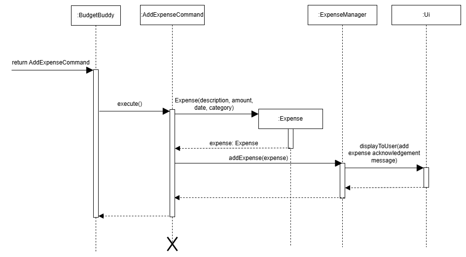

#### 4.3.1 Add Budget Feature
The Add Budget feature enables users to add budgets for different categories. This functionality is controlled by the 
AddBudgetCommand class, which is produced by the Parser class based on user input. The AddBudgetCommand class uses an 
AddBudgetValidator object to validate the provided amount, category, and date, and then performs the budget addition 
if valid. Below is the relevance of these attributes:

| Class Attribute | Variable Type | Relevance                                   |
|-----------------|---------------|---------------------------------------------|
| amount          | double        | The budget amount to be added               |
| category        | Category      | The category of budget to be added          |
| date            | YearMonth     | The specific month and year of budget added |

The BudgetBuddy class then calls the `execute()` method of the `AddBudgetCommand` object which uses the following 
method in the `BudgetManager` class to add a new budget created by the `Budget` class to the `budgets` list 
if it does not exist:

| Method            | Return Type | Relevance                               |
|-------------------|-------------|-----------------------------------------|
| addBudget(budget) | void        | Add new budget to the list of `budgets` |                                 

Then, `addAmount(category, amount)` method in the `Budget` class is also called to add the amount to the budget. 
Finally, the result is displayed to the user using the `Ui` class `displayToUser()` method.

The following UML Sequence diagram shows how to obtain the relevant inputs for the Add Budget Feature:

#### 4.3.2 Deduct Budget Feature
The Deduct Budget feature enables users to deduct an amount from an existing budget. This functionality is controlled 
by the DeductBudgetCommand class, which is produced by the Parser class based on user input. 
The DeductBudgetCommand class uses a DeductBudgetValidator object to validate the provided amount, category, and date, 
checks if the specified budget exists, and then performs the deduction if valid. 
Below is the relevance of these attributes:

| Class Attribute | Variable Type | Relevance                                      |
|-----------------|---------------|------------------------------------------------|
| amount          | double        | The budget amount to be deducted               |
| category        | Category      | The category of budget to be deducted          |
| date            | YearMonth     | The specific month and year of budget deducted |

The BudgetBuddy class then calls the `execute()` method of the `DeductBudgetCommand` object which uses the 
`deductAmount(category, amount)` method in the `Budget` class to deduct amount from the budget.

The following method in the `BudgetManager` class called by `deductAmount(category, amount)` to delete a budget from 
the `budgets` list if the total amount of the budget reaches zero:

| Method               | Return Type | Relevance                                |
|----------------------|-------------|------------------------------------------|
| deleteBudget(amount) | void        | Delete budget from the list of `budgets` |      

Finally, the result is displayed to the user using the `Ui` class `displayToUser()` method.

The following UML Sequence diagram shows how to obtain the relevant inputs for the Deduct Budget Feature:
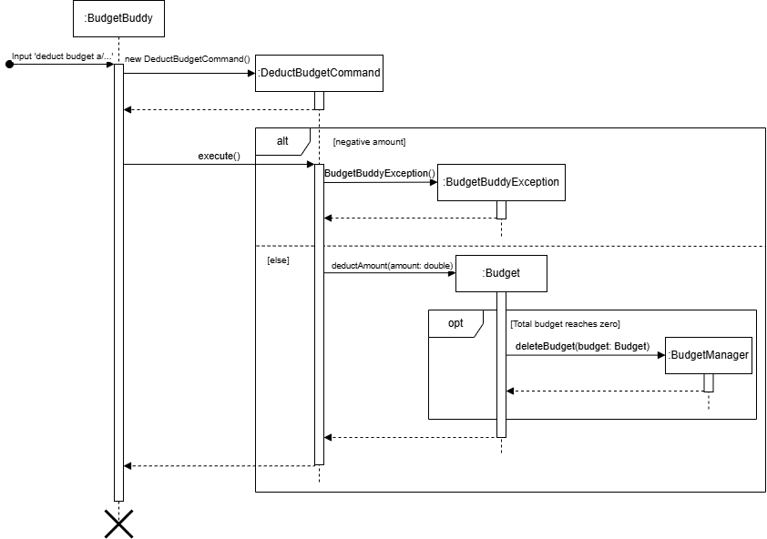

#### 4.3.3 List Budget Feature
The List Budget feature enables users to view all existing budgets or filter them based on the date. This functionality 
is controlled by the ListBudgetCommand class, which is produced by the Parser class based on user input. 
The ListBudgetCommand class uses a ListBudgetValidator object to validate the provided date, checks if the list request 
is valid, and, if valid, retrieves and displays the matching budget through the UI. If the validation fails, 
an error message is shown.

The following UML Sequence diagram shows how to obtain the relevant inputs for the List Budget Feature:
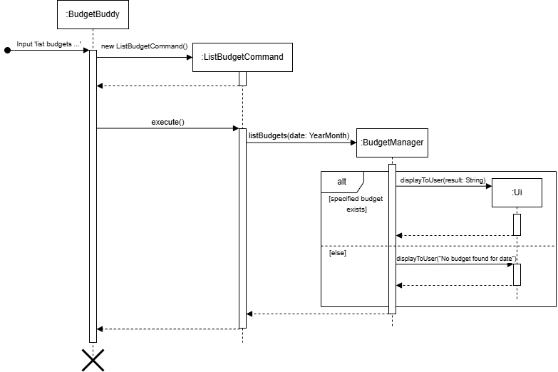

#### 4.3.4 List Remaining Feature
The `ListRemainingBudgetManager` will get the `Expenses` from `ExpenseManager` and `Budgets` from `BudgetManager`. All
the `Expense` amount will be deducted from the budget according to the date and category.

The following UML Sequence diagram shows how the Parser works to obtain the relevant inputs for the List Remaining 
Budgets Feature:
The loop to copy all the budget and the loop to match a expense to a budget are omitted to reduce complexity.

#### 4.1.3 List Expenses Feature
The List Expense feature enables users to view saved expenses in the application. Additionally, user may add additional
filters to display only desired categories and months. The total expense amount based on the displayed expenses will be
summed and displayed to the user. This feature is controlled by the `ListExpenseCommand` class, where it is initialized
by the `Parser` class. The `Parser` class uses `ListExpenseValidator` to check and extract the filter field that 
the user input. The `ListExpenseCommand` object is then created with a Category and YearMonth Attribute.

| Class Attribute | Variable Type | Relevance                                            |
|-----------------|---------------|------------------------------------------------------|
| category        | Category      | The category of expenses to be listed                |
| month           | YearMonth     | The specific month and year of expenses to be listed |

The `BudgetBuddy` class then calls the `execute()` method of `ListExpenseCommand` object which uses the following
methods in `ExpenseManager` class to list expenses based on user input category and month. If user does not specify a 
specific month or category, it will show every valid expense instead.

| Method                                 | Return Type | Relevance                                                    |
|----------------------------------------|-------------|--------------------------------------------------------------|
| listExpenses()                         | void        | Lists out all expenses saved                                 |
| listExpensesWithCategory(category)     | String      | Lists out all expenses saved with the specified category     |
| listExpensesWithDate(month)            | String      | Lists out all expenses saved in specified month              |
| listExpensesWithCategoryAndDate(month) | String      | Lists out all expenses saved in specified month and category |

Then, with the variations of `listExpenses()` commands in `ExpenseManager`, the list of expenses will be displayed to 
the user using the `Ui` class `displayToUser()` method.

The following UML Sequence diagram shows how the Parser works to obtain the relevant inputs for the List Expense Feature
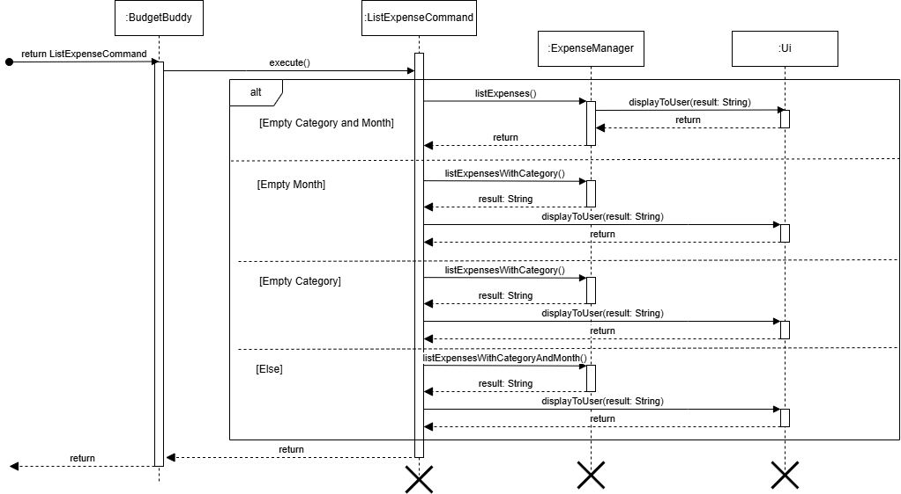

#### 4.2.1 List Income Feature
The List Income feature enables users to view saved income in the application. Additionally, user may add additional
filters to display only desired months. The total income amount based on the displayed income will be summed and 
displayed to the user. This feature is controlled by the `ListIncomeCommand` class, where it is initialized by the 
`Parser` class. The `Parser` class uses `ListIncomeValidator` to check and extract the filter field that the user
input. The `ListIncomeCommand` object is then created with a Category and YearMonth Attribute.

| Class Attribute | Variable Type | Relevance                                            |
|-----------------|---------------|------------------------------------------------------|
| month           | YearMonth     | The specific month and year of expenses to be listed |

The `BudgetBuddy` class then calls the `execute()` method of `ListIncomeCommand` object which uses the following
methods in `IncomeManager` class to list expenses based on user input category and month. If user does not specify a
specific month, it will show every valid expense instead.

| Method                      | Return Type | Relevance                                                    |
|-----------------------------|-------------|--------------------------------------------------------------|
| listIncomes()               | void        | Lists out all expenses saved                                 |
| listIncomesWithMonth(month) | String      | Lists out all expenses saved in specified month              |

Then, with the variations of `listIncomes()` commands in `IncomeManager`, the list of incomes will be displayed to
the user using the `Ui` class `displayToUser()` method.

The following UML Sequence diagram shows how the Parser works to obtain the relevant inputs for the List Income Feature

The following UML Sequence diagram shows how the Parser works to obtain the relevant inputs for the List Income Feature
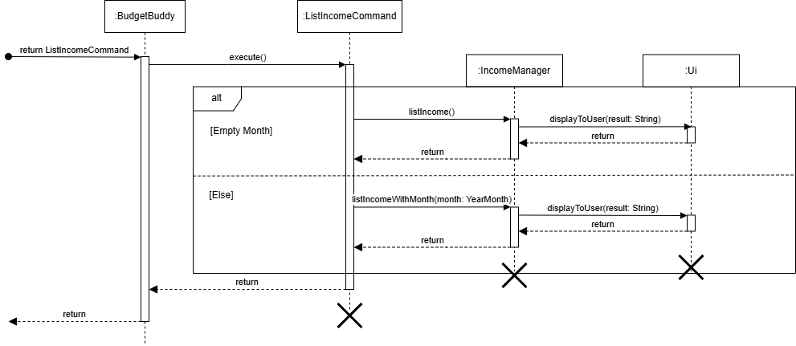

#### 4.1.3 Edit Expense Feature
The Edit Expense Feature enable users to edit pre-existing entries of expenses in the application. Users are only 
allowed to change the date, category and amount fields of the expense field. Currently, the description of each task 
cannot be edited, however it may be implemented for future versions. There are 2 sets of instruction that the user
has to input. The first set is to identify which expense to edit, while the second is the fields to be edited. This 
feature is controlled by the `EditExpenseCommand` class, where it is initialized by the `Parser` class. The following 
function is then called during the first set of user input.

| Method                      | Return Type | Relevance                                                          |
|-----------------------------|-------------|--------------------------------------------------------------------|
| getExpense(command)         | void        | Extracts the Expense from ExpenseList based on Index given by user |

`EditExpenseCommand` class contains the following attributes, which will be used to store the values that will replace
the existing value in the Expense object. During the creation of `EditExpenseCommand`, only `expense` object will be 
saved, will the other values will be initialized during subsequent function calls.

| Class Attribute | Variable Type | Relevance                                                              |
|-----------------|---------------|------------------------------------------------------------------------|
| category        | Category      | User input category value to replace current category value in expense |
| date            | LocalDate     | User input date value to replace current date value in expense         |
| amount          | double        | User input amount value to replace current amount value in expense     |
| expense         | Expense       | User specified Expense based on index                                  |

The `BudgetBuddy` class then calls the `execute()` method of `EditExpenseCommand` object which the `EditExpenseCommand` 
class then uses the `Ui` class to call function `getUserEditFields()` for editing the expense parameters. The 
`EditExpenseCommand` then uses `EditExpenseValidator` to check and extract for any valid fields. If valid, a 
`processEdit()` function will be called to update values in the expense object.

The following UML Sequence diagram shows how the Parser works to obtain the relevant inputs for the Edit Expense Feature
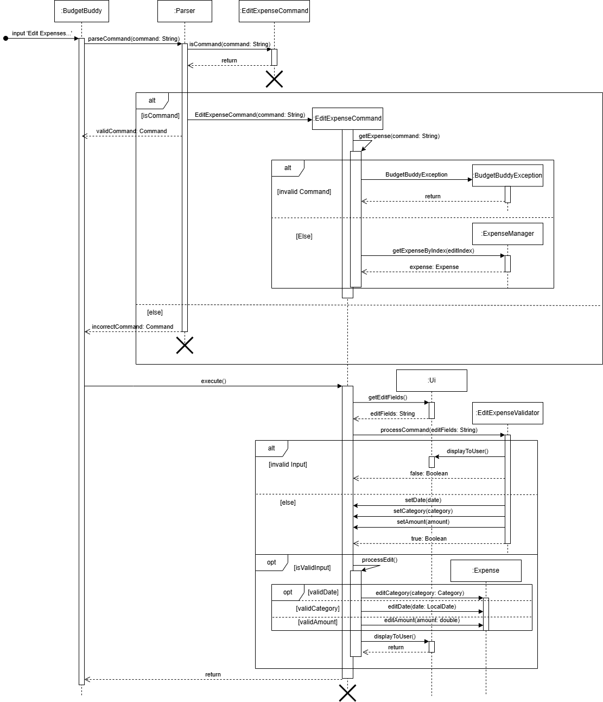

#### 4.2.2 Edit Income Feature
The Edit Income Feature enable users to edit pre-existing entries of incomes in the application. Users are only
allowed to change the date and amount fields of the income field. Currently, the description of each task
cannot be edited, however it may be implemented for future versions. There are 2 sets of instruction that the user
has to input. The first set is to identify which income to edit, while the second is the fields to be edited. This
feature is controlled by the `EditIncomeCommand` class, where it is initialized by the `Parser` class. The following
function is then called during the first set of user input.

| Method             | Return Type | Relevance                                                        |
|--------------------|-------------|------------------------------------------------------------------|
| getIncome(command) | void        | Extracts the Income from IncomeList based on Index given by user |

`EditIncomeCommand` class contains the following attributes, which will be used to store the values that will replace
the existing value in the Income object. During the creation of `EditIncomeCommand`, only `Income` object will be
saved, will the other values will be initialized during subsequent function calls.

| Class Attribute | Variable Type | Relevance                                                              |
|-----------------|---------------|------------------------------------------------------------------------| 
| date            | LocalDate     | User input date value to replace current date value in expense         |
| amount          | double        | User input amount value to replace current amount value in expense     |
| income          | Income        | User specified Income based on index                                   |

The `BudgetBuddy` class then calls the `execute()` method of `EditIncomeCommand` object which the `EditIncomeCommand`
class then uses the `Ui` class to call function `getUserEditFields()` for editing the expense parameters. The
`EditIncomeCommand` then uses `EditIncomeValidator` to check and extract for any valid fields. If valid, a
`processEdit()` function will be called to update values in the Income object.

The following UML Sequence diagram shows how the Parser works to obtain the relevant inputs for the Edit Income Feature
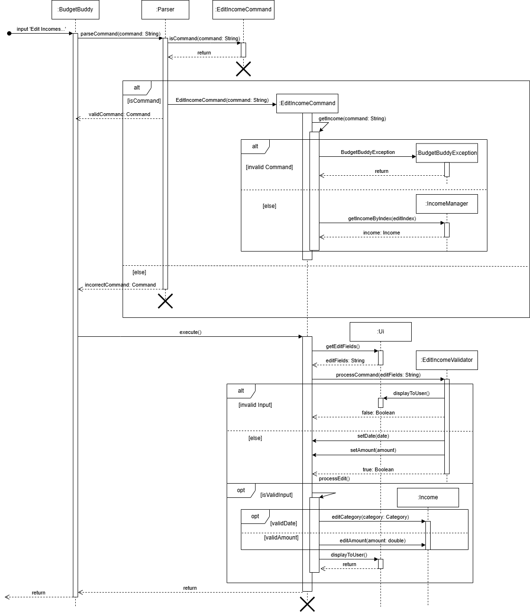

#### 4.4.2 Display Income Spent Feature
The Display Income Spent Feature shows users the percentage of income spent for a specific month. When the command is 
received, BudgetBuddy creates a DisplayIncomeSpentCommand object and executes it. The command then calls 
displaySpentPercentage(month) on IncomeSpent, which calculates the percentage for the specified month. The result is 
formatted with toString(month: YearMonth) and passed to the Ui component via displayToUser(result: String) for display 
to the user.

The following UML Sequence diagram shows how to obtain the relevant inputs for the Display Income Spent Feature:
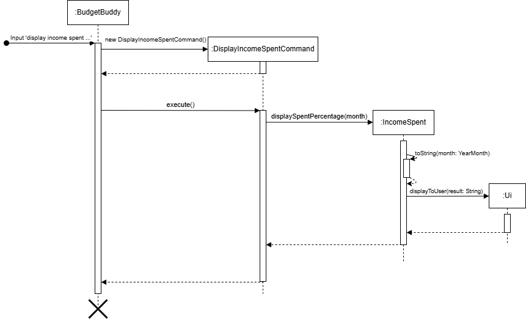

# Appendix

## Product scope
### Target user profile

{Describe the target user profile}

### Value proposition

{Describe the value proposition: what problem does it solve?}

## User Stories

| Version | As a ... | I want to ...                         | So that I can ...                                           |
|---------|----------|---------------------------------------|-------------------------------------------------------------|
| v1.0    | new user | see usage instructions                | refer to them when I forget how to use the application      |
| v1.0    | user     | add and delete income                 | track my incomes                                            |
| v1.0    | user     | add and delete expenses               | track my expenses                                           |
| v1.0    | user     | view a history of my past income      | see how my income changed over time                         |
| v1.0    | user     | view a history of my past expenses    | see how my expenses changed over time                       |
| v1.0    | user     | categorise my expenses                | understand where my money is going                          | 
| v1.0    | user     | search for specific expense entries   | quickly find past transactions                              |
| v1.0    | user     | view a history of my past budgets     | see how my spending has changed over time                   |
| v1.0    | user     | save and load my data automatically   | view my past entries                                        |
| v2.0    | user     | view the trends of my monthly expense | analyse my expense pattern                                  |
| v2.0    | user     | view the total expenses for one month | see a summary of my expenses for the month                  |
| v2.0    | user     | view my monthly savings               | plan for future expenses                                    |
| v2.0    | user     | see where I am spending my money      | better manage my expenses                                   |
| v2.0    | user     | find a to-do item by name             | locate a to-do without having to go through the entire list |
| v2.0    | user     | edit an existing expense entry       | correct any mistakes made to an expense entry               |
| v2.0    | user     | edit an existing income entry        | correct any mistakes made to an income entry                |

## Non-Functional Requirements

{Give non-functional requirements}

## Glossary

* *glossary item* - Definition

## Instructions for manual testing

{Give instructions on how to do a manual product testing e.g., how to load sample data to be used for testing}
